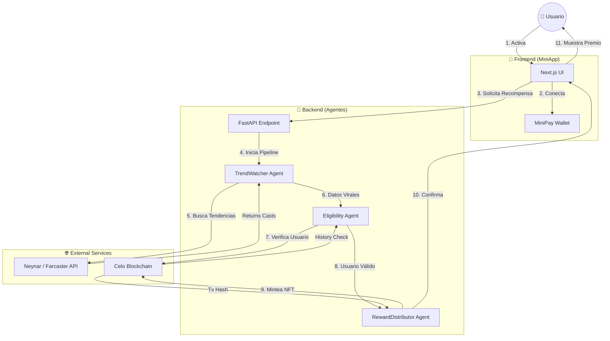
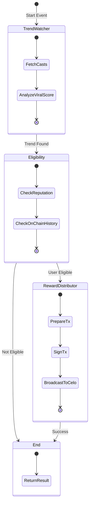

# 🏆 Premio.xyz (Celo + MiniPay + Multi-Agentes)

Una plataforma descentralizada que combina el poder de la **Inteligencia Artificial** con la velocidad de **Celo** para crear campañas de recompensas automáticas ("Loot Boxes") basadas en tendencias sociales de Farcaster.

---

## 🌟 Visión

El objetivo es gamificar la interacción en comunidades Web3. Cuando un tema se vuelve viral en Farcaster, nuestro sistema de agentes autónomos entra en acción:

1.  **Detecta** la tendencia real en Farcaster (usando Neynar API).
2.  **Identifica** a los usuarios más valiosos y activos (Eligibility).
3.  **Recompensa** instantáneamente con NFTs coleccionables directamente en su wallet.

Todo esto ocurre de forma transparente y verificable on-chain, con una experiencia de usuario "invisible" gracias a MiniPay.

---

## 🏗 Arquitectura del Sistema

El proyecto es un Monorepo que integra tres componentes principales:

### 1. 🤖 Servicio Multi-Agente (Python / LangGraph)
El "cerebro" de la operación. Orquesta un pipeline de agentes especializados:
*   **`TrendWatcherAgent`**: Escanea Farcaster (via Neynar) buscando conversaciones virales reales en tiempo real.
*   **`EligibilityAgent`**: Aplica filtros de reputación y verifica si el usuario ya participó.
*   **`RewardDistributorAgent`**: Ejecuta la distribución de premios. Firma transacciones reales en **Celo Sepolia** para mintear NFTs.

### 2. 📜 Contratos Inteligentes (Solidity / Foundry)
La capa de seguridad y liquidación, actualmente desplegada en **Celo Sepolia**:
*   **`LootBoxVault`**: Bóveda segura que custodia el presupuesto.
*   **`LootAccessRegistry`**: Registro on-chain que evita el "doble gasto" de recompensas.
*   **`LootBoxMinter`**: Contrato ERC721 optimizado para emitir NFTs conmemorativos.

#### 📍 Direcciones Desplegadas (Celo Sepolia)
| Contrato | Dirección |
|----------|-----------|
| **LootBoxVault** | `0x4Db514984aAE6A24A05f07c30310050c245b0256` |
| **LootAccessRegistry** | `0x4f7aA310c1f90e435f292f5D9bA07cb102409990` |
| **LootBoxMinter** | `0x28A499Be43D2e9720E129725e052781746e59D1D` |

### 📊 Flujo del Sistema



### 🔄 Pipeline de Agentes (LangGraph)



### 3. 📱 Frontend & MiniPay (Next.js 14)
La interfaz de usuario optimizada para móviles (MiniApp):
*   **Live Monitor**: Visualización 3D en tiempo real de los agentes.
*   **Leaderboard**: Tabla de clasificación y tendencias activas.
*   **Reward Selector**: Interfaz gamificada para reclamar premios.
*   **Dark Mode**: Estética "Sci-Fi/Tech" optimizada para pantallas OLED.

---

## 🚀 Tecnologías Clave

*   **Blockchain**: Celo (Compatible EVM, Mobile-first).
*   **Framework de Agentes**: LangGraph + LangChain (Python).
*   **Smart Contracts**: Foundry (Test, Script, Deploy).
*   **Frontend**: Next.js, TailwindCSS, RainbowKit, Wagmi.
*   **Social Data**: Farcaster (Neynar API).

---

## 🛠 Puesta en Marcha (Local)

Sigue estos pasos para levantar todo el entorno de desarrollo en tu máquina.

### Prerrequisitos
*   Node.js 18+ y PNPM.
*   Python 3.11+.
*   Foundry (Forge/Cast).

### 1. Configuración Inicial
Clona el repo e instala dependencias del workspace JS:

```bash
pnpm install
```

### 2. Levantar el Servicio de Agentes (Backend)
Este servicio corre en el puerto `8001`.

```bash
cd apps/agents
python3 -m venv .venv
source .venv/bin/activate
pip install -e ".[dev]"

# Copia y configura las variables de entorno
cp env.sample .env
# IMPORTANTE: Asegúrate de poner tu NEYNAR_API_KEY y CELO_PRIVATE_KEY en .env

# Inicia el servidor con recarga automática
uvicorn src.main:app --reload --port 8001
```

### 3. Levantar el Frontend (Web)
La aplicación web corre en el puerto `3000`.

```bash
# En una nueva terminal, desde la raíz del proyecto
cd apps/web
cp env.sample .env
pnpm dev
```

Abre [http://localhost:3000](http://localhost:3000) en tu navegador.

---

## 🧪 Probando el Flujo (Demo)

1.  Asegúrate de tener el **Backend** y el **Frontend** corriendo.
2.  Ve a `http://localhost:3000`.
3.  Conecta tu Wallet (Celo Sepolia).
4.  Haz clic en **"Activar Recompensas"**.
5.  Observa el **Live Monitor** analizando Farcaster en tiempo real.
6.  Elige tu premio y espera la confirmación de la transacción.

---

## ☁️ Despliegue en Producción (Vercel)

Esta aplicación está optimizada para desplegarse en **Vercel** (Frontend) y **Railway/Render** (Backend Python).

### Desplegando el Frontend (Apps/Web)

1.  Ve al [Dashboard de Vercel](https://vercel.com/new).
2.  Importa tu repositorio de GitHub.
3.  **Configuración del Proyecto:**
    *   **Root Directory:** Selecciona `apps/web` (haz clic en Edit).
    *   **Framework Preset:** Next.js (se detecta automático).
    *   **Environment Variables:** Añade las siguientes:
        *   `NEXT_PUBLIC_WC_PROJECT_ID`: Tu ID de WalletConnect.
        *   `AGENT_SERVICE_URL`: La URL donde desplegaste el backend (ej. `https://mi-backend-agents.railway.app`) o `http://localhost:8001` si estás probando localmente.

### Desplegando el Backend (Apps/Agents)

El backend requiere un entorno Python. Recomendamos usar **Railway**:

1.  Crea un nuevo servicio desde GitHub repo.
2.  **Root Directory:** `apps/agents`.
3.  **Build Command:** `pip install -e .`
4.  **Start Command:** `uvicorn src.main:app --host 0.0.0.0 --port $PORT`
5.  Configura las variables de entorno (`CELO_PRIVATE_KEY`, `NEYNAR_API_KEY`, etc.).

---

## 🔮 Próximos Pasos

*   [x] **Despliegue en Testnet**: Contratos activos en Celo Sepolia.
*   [x] **Integración Real**: Agentes conectados a Neynar API y firmando transacciones reales.
*   [x] **UX/UI Pro**: Rebranding a Premio.xyz, Dark Mode y Animaciones 3D.
*   [ ] **Mainnet Launch**: Despliegue en Celo Mainnet.
*   [ ] **ZK Proofs**: Integrar Semaphore para privacidad.
