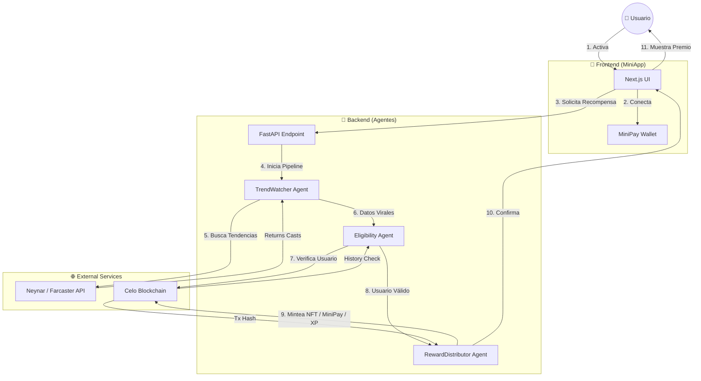
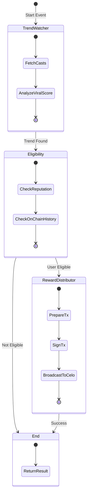

# 🏆 Premio.xyz (Celo + MiniPay + Multi-Agentes)

Una plataforma descentralizada que combina el poder de la **Inteligencia Artificial** con la velocidad de **Celo** para crear campañas de recompensas automáticas ("Loot Boxes") basadas en tendencias sociales de Farcaster.

---

## 🌟 Visión

El objetivo es gamificar la interacción en comunidades Web3. Cuando un tema se vuelve viral en Farcaster, nuestro sistema de agentes autónomos entra en acción:

1.  **Detecta** la tendencia real en Farcaster (usando Neynar API).
2.  **Identifica** a los usuarios más valiosos y activos (Eligibility).
3.  **Recompensa** instantáneamente con NFTs coleccionables directamente en su wallet.

Todo esto ocurre de forma transparente y verificable on-chain, con una experiencia de usuario "invisible" gracias a MiniPay.

---

## 🏗 Arquitectura del Sistema

El proyecto es un Monorepo que integra tres componentes principales:

### 1. 🤖 Servicio Multi-Agente (Python / LangGraph)
El "cerebro" de la operación. Orquesta un pipeline de agentes especializados:
*   **`TrendWatcherAgent`**: Escanea Farcaster (via Neynar) buscando conversaciones virales reales en tiempo real.
*   **`EligibilityAgent`**: Aplica filtros de reputación y verifica si el usuario ya participó.
*   **`RewardDistributorAgent`**: Ejecuta la distribución de premios. Firma transacciones reales en **Celo Sepolia** para mintear NFTs, asigna XP on-chain y dispara micropagos MiniPay/cUSD según la recompensa elegida.
*   **`LeaderboardStore`**: Guarda históricamente los ganadores (puntaje, recompensa y hash) para exponerlos al frontend y al leaderboard de la MiniApp.

### 2. 📜 Contratos Inteligentes (Solidity / Foundry)
La capa de seguridad y liquidación, actualmente desplegada en **Celo Sepolia**:
*   **`LootBoxVault`**: Bóveda segura que custodia el presupuesto y distribuye cUSD.
*   **`LootAccessRegistry`**: Registro on-chain que evita el "doble gasto" de recompensas y otorga XP.
*   **`LootBoxMinter`**: Contrato ERC721 optimizado para emitir NFTs conmemorativos.

**🚀 Deployment:** Los contratos se despliegan automáticamente usando el script `apps/contracts/script/DeployProduction.s.sol` que incluye mejoras de seguridad y configuración automática. Ver [DEPLOYMENT.md](apps/contracts/DEPLOYMENT.md) para más detalles.

#### 📍 Direcciones Desplegadas (Celo Sepolia) - PRODUCCIÓN

| Contrato | Dirección | Explorer |
|----------|-----------|----------|
| **LootBoxVault** | `0x3808D0C3525C4F85F1f8c9a881E3949327FB9cF7` | [Ver en Blockscout](https://celo-sepolia.blockscout.com/address/0x3808D0C3525C4F85F1f8c9a881E3949327FB9cF7) |
| **LootAccessRegistry** | `0x86C878108798e2Ce39B783127955B8F8A18ae2BE` | [Ver en Blockscout](https://celo-sepolia.blockscout.com/address/0x86C878108798e2Ce39B783127955B8F8A18ae2BE) |
| **LootBoxMinter** | `0x0d7370f79f77Ee701C5F40443F8C8969C28b3412` | [Ver en Blockscout](https://celo-sepolia.blockscout.com/address/0x0d7370f79f77Ee701C5F40443F8C8969C28b3412) |

**Nota:** Estos contratos están desplegados y configurados con los roles necesarios para que el agente pueda distribuir recompensas automáticamente. El usuario **NO necesita firmar transacciones** - todo es automático.

### 📊 Flujo del Sistema



### 🔄 Pipeline de Agentes (LangGraph)



### 3. 📱 Frontend & MiniPay (Next.js 14)
La interfaz de usuario optimizada para móviles (MiniApp):
*   **Live Monitor**: Visualización 3D en tiempo real de los agentes.
*   **Leaderboard Dinámico**: Consumido directamente desde los agentes (`/api/lootbox/leaderboard`) para mostrar tendencias, XP acumulado y ganadores reales.
*   **Reward Selector**: Interfaz gamificada para reclamar premios.
*   **Dark Mode**: Estética "Sci-Fi/Tech" optimizada para pantallas OLED.

---

## 🚀 Tecnologías Clave

*   **Blockchain**: Celo (Compatible EVM, Mobile-first).
*   **Framework de Agentes**: LangGraph + LangChain (Python).
*   **Smart Contracts**: Foundry (Test, Script, Deploy).
*   **Frontend**: Next.js, TailwindCSS, RainbowKit, Wagmi.
*   **Social Data**: Farcaster (Neynar API).

---

## 🛠 Puesta en Marcha (Local)

Sigue estos pasos para levantar todo el entorno de desarrollo en tu máquina.

### Prerrequisitos
*   Node.js 18+ y PNPM.
*   Python 3.11+.
*   Foundry (Forge/Cast).

### 1. Configuración Inicial
Clona el repo e instala dependencias del workspace JS:

```bash
pnpm install
```

### 2. Levantar el Servicio de Agentes (Backend)
Este servicio corre en el puerto `8001`.

```bash
cd apps/agents
python3 -m venv .venv
source .venv/bin/activate
pip install -e ".[dev]"

# Copia y configura las variables de entorno
cp env.sample .env
# IMPORTANTE: Asegúrate de poner tu NEYNAR_API_KEY, CELO_PRIVATE_KEY,
# MINIPAY_PROJECT_SECRET, XP_REWARD_AMOUNT y direcciones de los contratos en .env

# Inicia el servidor con recarga automática
uvicorn src.main:app --reload --port 8001
```

### 3. Levantar el Frontend (Web)
La aplicación web corre en el puerto `3000`.

```bash
# En una nueva terminal, desde la raíz del proyecto
cd apps/web
cp env.sample .env
pnpm dev
```

Abre [http://localhost:3000](http://localhost:3000) en tu navegador.

---

## 🧪 Probando el Flujo (Demo)

1.  Asegúrate de tener el **Backend** y el **Frontend** corriendo.
2.  Ve a `http://localhost:3000`.
3.  Conecta tu Wallet (Celo Sepolia).
4.  Haz clic en **"Activar Recompensas"**.
5.  Observa el **Live Monitor** analizando Farcaster en tiempo real.
6.  Elige tu premio (NFT, XP o cUSD) y espera la confirmación correspondiente.
7.  Verifica los ganadores y temas activos en el leaderboard (datos en vivo).

---

## ☁️ Despliegue en Producción (Vercel)

Esta aplicación está optimizada para desplegarse en **Vercel** (Frontend) y **Railway/Render** (Backend Python).

### Desplegando el Frontend (Apps/Web)

1.  Ve al [Dashboard de Vercel](https://vercel.com/new).
2.  Importa tu repositorio de GitHub.
3.  **Configuración del Proyecto:**
    *   **Root Directory:** Selecciona `apps/web` (haz clic en Edit).
    *   **Framework Preset:** Next.js (se detecta automático).
    *   **Environment Variables:** Añade las siguientes:
        *   `NEXT_PUBLIC_WC_PROJECT_ID`: Tu ID de WalletConnect.
        *   `AGENT_SERVICE_URL`: La URL donde desplegaste el backend (ej. `https://mi-backend-agents.railway.app`) o `http://localhost:8001` si estás probando localmente.

### Desplegando el Backend (Apps/Agents)

¡También puedes desplegar el backend en Vercel! (Serverless Python).

1.  En Vercel, crea un **Nuevo Proyecto** e importa el **mismo repositorio**.
2.  **Project Name:** `lootbox-agents` (o similar).
3.  **Root Directory:** `apps/agents`.
4.  **Framework Preset:** Other (Vercel detectará Python automáticamente).
5.  **Environment Variables:** Copia el contenido de `apps/agents/.env` a Vercel.

**Nota:** Al ser Serverless, las funciones tienen un tiempo límite de ejecución (10s en plan gratuito). Si los agentes tardan mucho en pensar, considera usar **Railway** o **Render** para evitar timeouts.

---

## 💡 MiniPay: Wallet vs Tool API

**IMPORTANTE:** Hay dos formas de usar MiniPay en este proyecto, y son diferentes:

### 1. MiniPay como Wallet (Frontend) ✅ **NO requiere PROJECT_ID**

Cuando el usuario abre tu MiniApp dentro de la app **MiniPay** (Android/iOS), MiniPay inyecta automáticamente `window.ethereum`. **NO necesitas** `MINIPAY_PROJECT_ID` para esto.

- El usuario se conecta automáticamente
- Puede firmar transacciones (mintear NFTs, recibir XP)
- Solo necesitas detectar `window.ethereum.isMiniPay` y ocultar el botón "Conectar Wallet"

**Para probar:** Instala la app MiniPay, activa Developer Mode → Use Testnet, y carga tu URL (usa `ngrok` para localhost).

### 2. MiniPay Tool API (Backend) ⚠️ **OPCIONAL - requiere PROJECT_SECRET**

El `MINIPAY_PROJECT_ID` y `MINIPAY_PROJECT_SECRET` son para usar la **API de MiniPay Tool** que permite enviar micropagos programáticamente desde el backend cuando el usuario elige "cUSD Drop".

**Si NO tienes acceso a esta API:**
- El sistema automáticamente usa el contrato `LootBoxVault` como alternativa
- Distribuye cUSD directamente desde el contrato (más gas, pero funciona sin API)
- Solo necesitas tener fondos cUSD en el `LootBoxVault` y configurar la campaña

**Si SÍ tienes acceso:**
- Configura `MINIPAY_PROJECT_ID` y `MINIPAY_PROJECT_SECRET` en `.env`
- El sistema usará la API de MiniPay Tool (más rápido, menos gas)

**Resumen:**
- **Frontend (wallet)**: No necesitas PROJECT_ID, solo detectar `window.ethereum.isMiniPay`
- **Backend (drops)**: PROJECT_SECRET es opcional; si no lo tienes, usa `LootBoxVault`

---

## 🔮 Próximos Pasos

*   [x] **Despliegue en Testnet**: Contratos activos en Celo Sepolia.
*   [x] **Integración Real**: Agentes conectados a Neynar API y firmando transacciones reales.
*   [x] **UX/UI Pro**: Rebranding a Premio.xyz, Dark Mode, Animaciones 3D y leaderboard vivo.
*   [ ] **Mainnet Launch**: Despliegue en Celo Mainnet.
*   [ ] **ZK Proofs**: Integrar Semaphore para privacidad.

---

## 📡 API Pública

El backend FastAPI expone endpoints listos para producción:

| Método | Ruta | Descripción |
| --- | --- | --- |
| `GET` | `/healthz` | Verificación de estado. |
| `POST` | `/api/lootbox/run` | Ejecuta el pipeline completo (detecta tendencia, puntúa usuarios y reparte el loot). Respeta `reward_type` = `nft`/`cusd`/`xp`. |
| `GET` | `/api/lootbox/leaderboard?limit=5` | Devuelve los últimos ganadores y tendencias activas consumidos por el frontend. |

---

## 📝 Información del Proyecto

### Description *

Premio.xyz es una plataforma descentralizada que gamifica la participación en comunidades Web3 mediante un sistema de recompensas automáticas basado en inteligencia artificial. Utiliza agentes autónomos para detectar tendencias virales en Farcaster, identificar usuarios valiosos y distribuir recompensas instantáneamente (NFTs, cUSD o XP) directamente en sus wallets, todo de forma transparente y verificable on-chain.

### Problem *

Las comunidades Web3 y las plataformas sociales descentralizadas enfrentan el desafío de incentivar y reconocer la participación genuina de sus miembros. Actualmente, los usuarios activos que crean contenido valioso, participan en discusiones relevantes y contribuyen al crecimiento de la comunidad no reciben reconocimiento ni recompensas proporcionales a su impacto. Esto desincentiva la participación de calidad y limita el crecimiento orgánico de las comunidades.

### Solution *

Premio.xyz resuelve este problema mediante un sistema multi-agente que:

1. **Detecta automáticamente** tendencias virales en Farcaster usando IA (Gemini) y APIs reales (Neynar)
2. **Analiza y puntúa** la participación de usuarios considerando múltiples factores: engagement, followers, power badges, y participación relacionada con la tendencia
3. **Distribuye recompensas automáticamente** según un sistema de tiers dinámico:
   - **Score >= 85**: NFTs coleccionables (Rare Loot)
   - **Score >= 60**: cUSD drops vía MiniPay Tool API
   - **Score < 60**: XP on-chain para reputación

Todo funciona de forma **completamente automática** - el usuario no necesita firmar transacciones, simplemente participa en Farcaster y recibe recompensas directamente en su wallet MiniPay.

### Mission Summary *

Estamos en una misión para construir un ecosistema Web3 más inclusivo y gamificado, donde la participación genuina y valiosa sea reconocida y recompensada automáticamente. A través de la integración de inteligencia artificial, blockchain (Celo) y redes sociales descentralizadas (Farcaster), creamos un sistema que incentiva la creación de contenido de calidad, fomenta la participación activa y construye comunidades más fuertes y comprometidas, todo mientras mantenemos la transparencia y verificabilidad on-chain.

### Location of Impact (optional)

**Global** - El proyecto está diseñado para impactar comunidades Web3 a nivel global, con especial enfoque en:
- Comunidades de desarrolladores y builders en Celo
- Usuarios activos en Farcaster
- Comunidades que buscan gamificar su participación y crecimiento
- Proyectos que quieren incentivar engagement de calidad en sus ecosistemas

### What is your business model? (optional)

**Modelo de Negocio: Plataforma B2B2C con Monetización por Uso**

Premio.xyz opera como una plataforma SaaS (Software as a Service) que permite a proyectos Web3, DAOs y comunidades implementar sistemas de recompensas automáticas:

1. **Suscripciones por Comunidad/Proyecto**: 
   - Planes mensuales basados en el volumen de recompensas distribuidas
   - Tier básico: Hasta 100 recompensas/mes
   - Tier profesional: Recompensas ilimitadas con analytics avanzados
   - Tier enterprise: Personalización completa y soporte dedicado

2. **Comisión por Transacción**:
   - Pequeña comisión (2-5%) sobre el valor de las recompensas distribuidas
   - Alternativamente, fee fijo por cada recompensa procesada

3. **Servicios de Consultoría**:
   - Configuración personalizada de agentes para casos de uso específicos
   - Integración con otras plataformas y blockchains
   - Desarrollo de contratos inteligentes personalizados

4. **Marketplace de NFTs**:
   - Comisión sobre la venta de NFTs generados por la plataforma
   - Opción de crear colecciones exclusivas para comunidades

**Modelo de Ingresos Futuro**:
- **Freemium**: Plan gratuito con límites básicos para comunidades pequeñas
- **Revenue Share**: Para proyectos grandes, compartir ingresos generados por el aumento de engagement
- **White-label**: Licenciar la tecnología a otras plataformas

### What stage are you in? (optional)

**MVP (Minimum Viable Product)** - El proyecto está en etapa de MVP funcional:

✅ **Completado**:
- Sistema multi-agente funcionando en producción
- Contratos inteligentes desplegados en Celo Sepolia
- Frontend desplegado y funcional
- Integración completa con Farcaster (Neynar API)
- Distribución automática de recompensas (NFT, cUSD, XP)
- Leaderboard en tiempo real

🚧 **En Desarrollo**:
- Optimización de agentes para mejor detección de tendencias
- Expansión a otras redes sociales (Lens, X/Twitter)
- Dashboard de analytics para comunidades
- Sistema de suscripciones y monetización

📋 **Próximos Pasos**:
- Lanzamiento en Celo Mainnet
- Integración con más blockchains
- Programa piloto con comunidades reales
- Recopilación de feedback y métricas de uso

### How much money have you raised from grants or investors? (optional)

**Financiamiento Actual**: $0 USD

El proyecto está siendo desarrollado como parte del **Celo Build Hackathon** y actualmente no ha recibido financiamiento externo. Estamos buscando:

1. **Grants de Ecosistemas**:
   - Celo Foundation grants para proyectos que impulsen la adopción de MiniPay
   - Farcaster ecosystem grants para herramientas que mejoren la experiencia social
   - Web3 foundation grants para infraestructura descentralizada

2. **Seed Funding**:
   - Buscando inversión inicial para escalar el equipo y acelerar el desarrollo
   - Enfoque en inversores que entiendan Web3, social networks y AI

3. **Programas de Aceleración**:
   - Aplicación a programas como Celo Camp, Consensys Accelerator, o Web3 accelerators

**Uso de Fondos**:
- Desarrollo de producto (40%)
- Marketing y crecimiento de comunidades (30%)
- Infraestructura y operaciones (20%)
- Reserva de emergencia (10%)

---
