<div align="center">
  

  # 🏆 Premio.xyz
  
  **Viral Rewards on Farcaster powered by Celo & AI**

  [](https://opensource.org/licenses/MIT)
  [](https://celo.org)
  [](https://minipay.celo.org)
  [](https://farcaster.xyz)
</div>

---

> **Hackathon Submission:** Celo Build the Future 🚀  
> **Mission:** Gamify Web3 communities by rewarding genuine engagement automatically.

## 🌟 Overview

**Premio.xyz** is a decentralized agentic platform that turns social engagement into tangible rewards. When a topic goes viral on Farcaster, our autonomous AI agents detect it, identify the top contributors, and instantly reward them with **NFTs**, **cUSD**, or **XP** directly to their MiniPay wallet.

No claiming, no signing, no friction. Just participate and get rewarded.

### ✨ Key Features

- **🤖 Autonomous Agents:** LangGraph-based agents that scan, analyze, and execute transactions without human intervention.
- **📱 Mobile-First:** Designed specifically for **MiniPay** inside Opera Mini.
- **⚡ Instant Rewards:** Automated distribution of cUSD (via MiniPay) and NFTs (via Contracts).
- **🎨 Premium UI:** Full "Dark Sci-Fi" aesthetic with Glassmorphism, Neon accents, and smooth animations.
- **🔋 Energy System:** Gamified user interaction with recharge mechanics and cooldowns to prevent spam.
- **🖼️ Viral Frames:** Native Farcaster Frames for sharing victories and driving viral growth.
- **🧠 AI Analysis:** Google Gemini AI analyzes sentiment and "viral score" to filter spam.
- **🌍 Bilingual & Themed:** Full English/Spanish support and Dark/Light modes.

---

## 🏗 System Architecture

We employ a **Multi-Agent System** architecture where specialized agents handle specific tasks in a pipeline.

```mermaid
graph TD
    subgraph "📱 User Experience (MiniApp)"
        UI[Next.js Frontend]
        Wallet[MiniPay Wallet]
        Frame[Viral Share Frame]
    end
    
    subgraph "🧠 Agentic Brain (Python/LangGraph)"
        Orchestrator[Orchestrator Agent]
        Trend[Trend Watcher]
        Elig[Eligibility Engine]
        Dist[Reward Distributor]
        Energy[Energy Service]
    end
    
    subgraph "🔗 On-Chain Infrastructure (Celo Mainnet)"
        Registry[LootAccessRegistry]
        Vault["LootBoxVault (Funds)"]
        NFT["LootBoxMinter (NFTs)"]
    end

    subgraph "🌐 Data Sources"
        Neynar["Neynar API (Farcaster)"]
        Gemini[Google Gemini AI]
    end

    UI -->|1. Trigger Scan| Orchestrator
    Orchestrator -->|2. Check Stamina| Energy
    Orchestrator -->|3. Delegate| Trend
    Trend -->|4. Fetch Casts| Neynar
    Trend -->|5. Analyze Sentiment| Gemini
    Trend -->|6. Viral Candidates| Elig
    
    Elig -->|7. Check Reputation| Registry
    Elig -->|8. Verify User| Dist
    
    Dist -->|9. Mint NFT| NFT
    Dist -->|10. Send cUSD| Vault
    Dist -->|11. Grant XP| Registry
    
    NFT -.->|Ownership| Wallet
    Vault -.->|cUSD Transfer| Wallet
    Frame -->|Deep Link| UI
```



---

## 🔄 How it Works

1.  **Detection**: The `TrendWatcher` agent constantly scans Farcaster for hashtags or keywords associated with active campaigns.
2.  **Scoring**: User interactions are analyzed. A "Viral Score" (0-100) is calculated based on likes, recasts, replies, and user reputation (Power Badge).
3.  **Reward**:
    *   **Score > 85**: Grants a **Rare Loot NFT** 🎨 (Dynamic Art based on your Cast).
    *   **Score > 60**: Sends **cUSD** directly to the user (Micropayments) 💵.
    *   **Score < 60**: Awards **XP** (On-chain reputation) ⭐.
4.  **Viral Loop**: Winners share their "Victory Frame" on Farcaster, which allows others to launch the MiniApp directly.
5.  **Recharge**: Users can share their status to recharge their energy and play again.

### 📊 Simple Flow Diagram

```mermaid
flowchart LR
    A[👤 Usuario<br/>Postea en Farcaster] --> B[🤖 Sistema Detecta<br/>Contenido Viral]
    B --> C[📊 Analiza Engagement<br/>Likes, Recasts, Replies]
    C --> D{🎯 Calcula<br/>Viral Score}
    D -->|Score > 85| E[🎨 NFT<br/>Rare Loot]
    D -->|Score > 60| F[💵 cUSD<br/>Micropayment]
    D -->|Score < 60| G[⭐ XP<br/>On-chain Rep]
    E --> H[✅ Recompensa<br/>Automática]
    F --> H
    G --> H
    H --> I[📱 Wallet Celo<br/>MiniPay]
    
    style A fill:#855DCD,stroke:#FCFF52,stroke-width:2px,color:#fff
    style B fill:#FCFF52,stroke:#855DCD,stroke-width:2px,color:#000
    style C fill:#855DCD,stroke:#FCFF52,stroke-width:2px,color:#fff
    style D fill:#FCFF52,stroke:#855DCD,stroke-width:2px,color:#000
    style E fill:#00ff00,stroke:#fff,stroke-width:2px,color:#000
    style F fill:#00ff00,stroke:#fff,stroke-width:2px,color:#000
    style G fill:#00ff00,stroke:#fff,stroke-width:2px,color:#000
    style H fill:#855DCD,stroke:#FCFF52,stroke-width:3px,color:#fff
    style I fill:#FCFF52,stroke:#855DCD,stroke-width:2px,color:#000
```



---

## 🛠 Tech Stack

### Frontend (Apps/Web)
*   **Next.js 14**: App Router, Server Components.
*   **TailwindCSS**: Custom "Sci-Fi" design system with detailed animations.
*   **Wagmi / Viem**: Blockchain interaction on Celo Mainnet.
*   **Farcaster Auth**: Farcaster Kit for login.
*   **Farcaster Frames**: Native integration for sharing.
*   **I18n**: Custom lightweight internationalization.

### Backend Agents (Apps/Agents)
*   **Python 3.11**: Core runtime.
*   **LangGraph**: Orchestration of stateful multi-agent workflows.
*   **FastAPI**: REST API entrypoints.
*   **Pydantic**: Data validation and typed settings.
*   **AsyncIO**: High-concurrency task management.

### Contracts (Apps/Contracts)
*   **Solidity 0.8.20**: Smart contract language.
*   **Foundry**: Development, testing, and deployment framework.
*   **OpenZeppelin**: Standard secure implementations (ERC20, ERC721).

---

## 🚀 Getting Started

### Prerequisites
- Node.js 18+ & PNPM
- Python 3.10+ & Poetry/Pip
- Foundry (Forge)

### 1. Installation

```bash
# Clone the repo
git clone https://github.com/MarxMad/CeloBuild-.git
cd lootbox-minipay

# Install JS dependencies
pnpm install
```

### 2. Setup Agents (Backend)

```bash
cd apps/agents
python3 -m venv .venv
source .venv/bin/activate
pip install -e ".[dev]"

# Configure environment
cp env.sample .env
# Add NEYNAR_API_KEY, CELO_PRIVATE_KEY, etc.
```

### 3. Run Development Server

```bash
# In separate terminals:
# 1. Run Agents
cd apps/agents
uvicorn src.main:app --reload --port 8001

# 2. Run Frontend
cd apps/web
pnpm dev
```

Visit `http://localhost:3000` to see the app running.

---

## 📜 Deployed Contracts (Celo Mainnet)

| Contract | Address |
|----------|---------|
| **LootBoxVault** | [`0x2c8c787af0d123a7bedf20064f3ad45aaafd6020`](https://celoscan.io/address/0x2c8c787af0d123a7bedf20064f3ad45aaafd6020) |
| **LootAccessRegistry** | [`0x4a948a06422116fcd8dcd9eacac32e5c40b0e400`](https://celoscan.io/address/0x4a948a06422116fcd8dcd9eacac32e5c40b0e400) |
| **LootBoxMinter** | [`0x455fa0b0de62fead3032f8485cddd9e606cc7c7d`](https://celoscan.io/address/0x455fa0b0de62fead3032f8485cddd9e606cc7c7d) |

---

<div align="center">
  <sub>Built with ❤️ by Gerry & The Team for Celo Build 2025</sub>
</div>
