<div align="center">
  

  # 🏆 Premio.xyz
  
  **Viral Rewards on Farcaster powered by Celo & AI**

  [](https://opensource.org/licenses/MIT)
  [](https://celo.org)
  [](https://minipay.celo.org)
  [](https://farcaster.xyz)
</div>

---

> **Hackathon Submission:** Celo Build the Future 🚀  
> **Mission:** Gamify Web3 communities by rewarding genuine engagement automatically.

## 🌟 Overview

**Premio.xyz** is a decentralized agentic platform that turns social engagement into tangible rewards. When a topic goes viral on Farcaster, our autonomous AI agents detect it, identify the top contributors, and instantly reward them with **NFTs**, **cUSD**, or **XP** directly to their MiniPay wallet.

No claiming, no signing, no friction. Just participate and get rewarded.

### ✨ Key Features

- **🤖 Autonomous Agents:** LangGraph-based agents that scan, analyze, and execute transactions without human intervention.
- **📱 Mobile-First:** Designed specifically for **MiniPay** inside Opera Mini.
- **⚡ Instant Rewards:** Automated distribution of cUSD (via MiniPay) and NFTs (via Contracts).
- **🎨 Premium UI:** Full "Dark Sci-Fi" aesthetic with Glassmorphism, Neon accents, and smooth animations.
- **🔋 Energy System:** Gamified user interaction with recharge mechanics and cooldowns to prevent spam.
- **🖼️ Viral Frames:** Native Farcaster Frames for sharing victories and driving viral growth.
- **🧠 AI Analysis:** Google Gemini AI analyzes sentiment and "viral score" to filter spam.
- **🌍 Bilingual & Themed:** Full English/Spanish support and Dark/Light modes.
- **✨ AI Cast Generation:** Generate viral Farcaster casts using AI (Gemini) with 5 different topics (Tech, Music, Motivation, Jokes, Famous Quotes).
- **📅 Scheduled Casts:** Schedule up to 3 casts per day with specific date and time.
- **💰 Pay-to-Post:** Users pay 0.5 cUSD to publish casts and receive 100 XP as reward.

---

## 🏗 System Architecture

We employ a **Multi-Agent System** architecture where specialized agents handle specific tasks in a pipeline.


---

## 🔄 How it Works

### **Flow 1: Viral Content Detection & Rewards**

1.  **Detection**: The `TrendWatcher` agent constantly scans Farcaster for hashtags or keywords associated with active campaigns.
2.  **Scoring**: User interactions are analyzed. A "Viral Score" (0-100) is calculated based on likes, recasts, replies, and user reputation (Power Badge).
3.  **Reward**:
    *   **Score > 85**: Grants a **Rare Loot NFT** 🎨 (Dynamic Art based on your Cast).
    *   **Score > 60**: Sends **cUSD** directly to the user (Micropayments) 💵.
    *   **Score < 60**: Awards **XP** (On-chain reputation) ⭐.
4.  **Viral Loop**: Winners share their "Victory Frame" on Farcaster, which allows others to launch the MiniApp directly.
5.  **Recharge**: Users can share their status to recharge their energy and play again.

### **Flow 2: AI Cast Generation & Scheduling**

1.  **Generate**: User selects a topic (Tech, Music, Motivation, Jokes, Famous Quotes) and AI generates a viral cast using Gemini.
2.  **Preview**: User reviews the generated cast before publishing.
3.  **Pay**: User pays 0.5 cUSD to the agent wallet to publish the cast.
4.  **Schedule or Publish**: User can publish immediately or schedule the cast for a specific date/time (up to 3 scheduled casts per day).
5.  **Reward**: When the cast is published, user receives 100 XP automatically.

### 📊 Simple Flow Diagram

```mermaid
flowchart LR
    A[👤 Usuario<br/>Postea en Farcaster] --> B[🤖 Sistema Detecta<br/>Contenido Viral]
    B --> C[📊 Analiza Engagement<br/>Likes, Recasts, Replies]
    C --> D{🎯 Calcula<br/>Viral Score}
    D -->|Score > 85| E[🎨 NFT<br/>Rare Loot]
    D -->|Score > 60| F[💵 cUSD<br/>Micropayment]
    D -->|Score < 60| G[⭐ XP<br/>On-chain Rep]
    E --> H[✅ Recompensa<br/>Automática]
    F --> H
    G --> H
    H --> I[📱 Wallet Celo<br/>MiniPay]
    
    style A fill:#855DCD,stroke:#FCFF52,stroke-width:2px,color:#fff
    style B fill:#FCFF52,stroke:#855DCD,stroke-width:2px,color:#000
    style C fill:#855DCD,stroke:#FCFF52,stroke-width:2px,color:#fff
    style D fill:#FCFF52,stroke:#855DCD,stroke-width:2px,color:#000
    style E fill:#00ff00,stroke:#fff,stroke-width:2px,color:#000
    style F fill:#00ff00,stroke:#fff,stroke-width:2px,color:#000
    style G fill:#00ff00,stroke:#fff,stroke-width:2px,color:#000
    style H fill:#855DCD,stroke:#FCFF52,stroke-width:3px,color:#fff
    style I fill:#FCFF52,stroke:#855DCD,stroke-width:2px,color:#000
```



### 🔄 Complete App Flow Circle

```mermaid
flowchart TB
    Start([🚀 Usuario Inicia]) --> Choice{¿Qué quiere hacer?}
    
    Choice -->|Detectar Tendencias| Flow1[📊 Flow 1:<br/>Detección Viral]
    Choice -->|Generar Cast| Flow2[✨ Flow 2:<br/>Generación con IA]
    
    subgraph Flow1["📊 Flow 1: Detección Viral"]
        F1A[👤 Usuario Postea<br/>en Farcaster] --> F1B[🤖 TrendWatcher<br/>Detecta Tendencia]
        F1B --> F1C[📊 Eligibility<br/>Calcula Score]
        F1C --> F1D{🎯 Score?}
        F1D -->|>85| F1E[🎨 NFT]
        F1D -->|>60| F1F[💵 cUSD]
        F1D -->|<60| F1G[⭐ XP]
        F1E --> F1H[✅ Recompensa<br/>Automática]
        F1F --> F1H
        F1G --> F1H
        F1H --> F1I[📱 Wallet MiniPay]
    end
    
    subgraph Flow2["✨ Flow 2: Generación con IA"]
        F2A[🎨 Usuario Selecciona<br/>Tema] --> F2B[🤖 Gemini AI<br/>Genera Cast]
        F2B --> F2C[👀 Preview<br/>del Cast]
        F2C --> F2D[💰 Paga 0.5 cUSD<br/>al Agente]
        F2D --> F2E{📅 ¿Programar?}
        F2E -->|Sí| F2F[⏰ Scheduler<br/>Programa Cast]
        F2E -->|No| F2G[📤 Publica<br/>Inmediatamente]
        F2F --> F2H[⏳ Espera<br/>Fecha/Hora]
        F2H --> F2G
        F2G --> F2I[✅ Cast Publicado<br/>+100 XP]
    end
    
    F1I --> Loop[🔄 Círculo Continúa]
    F2I --> Loop
    Loop --> Choice
    
    style Start fill:#855DCD,stroke:#FCFF52,stroke-width:3px,color:#fff
    style Choice fill:#FCFF52,stroke:#855DCD,stroke-width:2px,color:#000
    style Flow1 fill:#855DCD,stroke:#FCFF52,stroke-width:2px,color:#fff
    style Flow2 fill:#00ff00,stroke:#855DCD,stroke-width:2px,color:#000
    style Loop fill:#855DCD,stroke:#FCFF52,stroke-width:3px,color:#fff
```



---

## 🛠 Tech Stack

### Frontend (Apps/Web)
*   **Next.js 14**: App Router, Server Components.
*   **TailwindCSS**: Custom "Sci-Fi" design system with detailed animations.
*   **Wagmi / Viem**: Blockchain interaction on Celo Mainnet.
*   **Farcaster Auth**: Farcaster Kit for login.
*   **Farcaster Frames**: Native integration for sharing.
*   **I18n**: Custom lightweight internationalization.

### Backend Agents (Apps/Agents)
*   **Python 3.11**: Core runtime.
*   **LangGraph**: Orchestration of stateful multi-agent workflows.
*   **FastAPI**: REST API entrypoints.
*   **Pydantic**: Data validation and typed settings.
*   **AsyncIO**: High-concurrency task management.
*   **APScheduler**: Scheduled task execution for cast publishing.
*   **Gemini AI**: Content generation for viral casts.

### Contracts (Apps/Contracts)
*   **Solidity 0.8.20**: Smart contract language.
*   **Foundry**: Development, testing, and deployment framework.
*   **OpenZeppelin**: Standard secure implementations (ERC20, ERC721).

---

## 🚀 Getting Started

### Prerequisites
- Node.js 18+ & PNPM
- Python 3.10+ & Poetry/Pip
- Foundry (Forge)

### 1. Installation

```bash
# Clone the repo
git clone https://github.com/MarxMad/CeloBuild-.git
cd lootbox-minipay

# Install JS dependencies
pnpm install
```

### 2. Setup Agents (Backend)

```bash
cd apps/agents
python3 -m venv .venv
source .venv/bin/activate
pip install -e ".[dev]"

# Configure environment
cp env.sample .env
# Add NEYNAR_API_KEY, CELO_PRIVATE_KEY, etc.
```

### 3. Run Development Server

```bash
# In separate terminals:
# 1. Run Agents
cd apps/agents
uvicorn src.main:app --reload --port 8001

# 2. Run Frontend
cd apps/web
pnpm dev
```

Visit `http://localhost:3000` to see the app running.

### 4. New Features: AI Cast Generation

The app now includes AI-powered cast generation:

- **Generate Casts**: Visit `/casts` to generate viral casts using AI
- **5 Topics Available**: Tech, Music, Motivation, Jokes, Famous Quotes
- **Schedule Casts**: Program up to 3 casts per day with specific date/time
- **Pay-to-Post**: Pay 0.5 cUSD to publish and receive 100 XP as reward

**API Endpoints:**
- `GET /api/casts/topics` - Get available topics
- `GET /api/casts/agent-address` - Get agent wallet address for payments
- `POST /api/casts/generate` - Generate cast with AI (preview)
- `POST /api/casts/publish` - Publish cast (requires payment)
- `GET /api/casts/scheduled` - Get user's scheduled casts
- `POST /api/casts/cancel` - Cancel scheduled cast

---

## 📜 Deployed Contracts (Celo Mainnet)

| Contract | Address |
|----------|---------|
| **LootBoxVault** | [`0x2c8c787af0d123a7bedf20064f3ad45aaafd6020`](https://celoscan.io/address/0x2c8c787af0d123a7bedf20064f3ad45aaafd6020) |
| **LootAccessRegistry** | [`0x4a948a06422116fcd8dcd9eacac32e5c40b0e400`](https://celoscan.io/address/0x4a948a06422116fcd8dcd9eacac32e5c40b0e400) |
| **LootBoxMinter** | [`0x455fa0b0de62fead3032f8485cddd9e606cc7c7d`](https://celoscan.io/address/0x455fa0b0de62fead3032f8485cddd9e606cc7c7d) |

---

<div align="center">
  <sub>Built with ❤️ by Gerry & The Team for Celo Build 2025</sub>
</div>
