# Arquitectura de Agentes Lootbox

Este documento explica la estructura y el flujo de los agentes de IA en el backend.

## 📂 Estructura de Archivos

Todos los archivos en `apps/agents/src` tienen un propósito específico en el flujo de la aplicación.

### 🧠 Graph (`/graph`)
Estos son los "cerebros" de la operación. Cada archivo representa un agente o un coordinador.

- **`supervisor.py`**: El director de orquesta. Recibe la petición, llama a los agentes en orden y compila el resultado final.
- **`trend_watcher.py`**: Analiza el contenido de Farcaster para detectar tendencias y validar si un post merece recompensa.
- **`eligibility.py`**: Verifica si el usuario cumple los requisitos (no es bot, tiene antigüedad, etc.) y calcula su puntuación.
- **`reward_distributor.py`**: El ejecutor. Decide qué premio dar (NFT, cUSD, XP) y llama a las herramientas para entregarlo.

### 📦 Stores (`/stores`)
Memoria persistente (o semi-persistente) de los agentes.

- **`leaderboard.py`**: Guarda el historial de ganadores para mostrar en la web.
- **`trends.py`**: Recuerda las tendencias detectadas para no procesar lo mismo dos veces.
- **`notifications.py`**: Almacena los tokens para enviar notificaciones push a los usuarios.

### 🛠️ Tools (`/tools`)
Herramientas que los agentes usan para interactuar con el mundo exterior.

- **`farcaster.py`**: Conexión con Neynar/Farcaster para leer perfiles y casts.
- **`celo.py`**: Conexión con la blockchain Celo para leer balances y ejecutar transacciones (XP, Contratos).
- **`minipay.py`**: API específica para enviar cUSD a través de MiniPay.
- **`art_generator.py`**: Usa Google Gemini para crear prompts y generar imágenes SVG para los NFTs.

### ⚙️ Core (`/src`)
- **`main.py`**: El servidor web (FastAPI) que conecta todo esto con el frontend (Next.js).
- **`config.py`**: Manejo de variables de entorno y configuración.
- **`scheduler.py`**: Ejecuta tareas en segundo plano (como limpiar memoria o procesos periódicos).
- **`lootbox_agents.egg-info`**: ℹ️ **Nota**: Esta carpeta contiene metadatos generados automáticamente por Python. No es código fuente y no necesitas editarla.

---

## 🔄 Flujo de Actividad

```mermaid
sequenceDiagram
    participant User as 👤 Usuario/Frontend
    participant Main as 🌐 API (main.py)
    participant Supervisor as 🤖 Supervisor
    participant Trend as 📈 TrendWatcher
    participant Elig as 🛡️ Eligibility
    participant Dist as 🎁 Distributor
    participant Chain as ⛓️ Celo/Tools

    User->>Main: Solicita Análisis
    Main->>Supervisor: Inicia Run
    
    rect rgb(30, 30, 30)
        Note right of Supervisor: Fase 1: Análisis
        Supervisor->>Trend: Analizar Contexto
        Trend-->>Supervisor: Trend Score & Context
    end

    rect rgb(40, 40, 40)
        Note right of Supervisor: Fase 2: Filtrado
        Supervisor->>Elig: Verificar Usuario
        Elig-->>Supervisor: Score & Ranking
    end

    rect rgb(50, 50, 50)
        Note right of Supervisor: Fase 3: Recompensa
        Supervisor->>Dist: Distribuir Premio
        
        alt Score Alto (NFT)
            Dist->>Chain: Generar Arte & Mintear NFT
        else Score Medio (cUSD)
            Dist->>Chain: Enviar cUSD
        else Score Bajo (XP)
            Dist->>Chain: Registrar XP
        end
        
        Dist-->>Supervisor: Resultado (TxHash, Imágenes)
    end

    Supervisor-->>Main: Resultado Final
    Main-->>User: JSON (incluye NFT Images)
```

